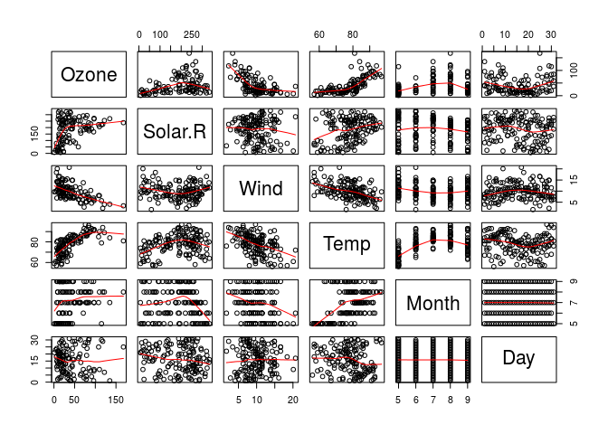
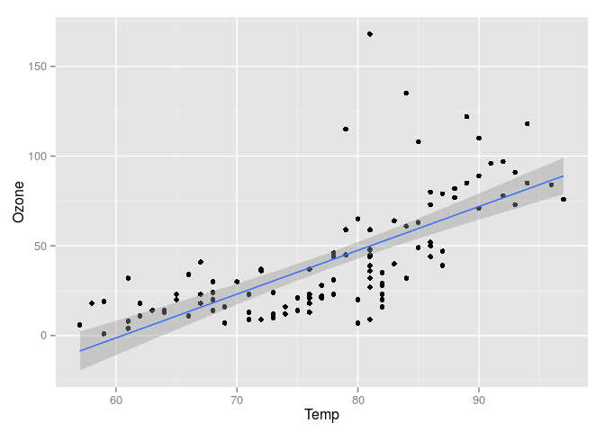
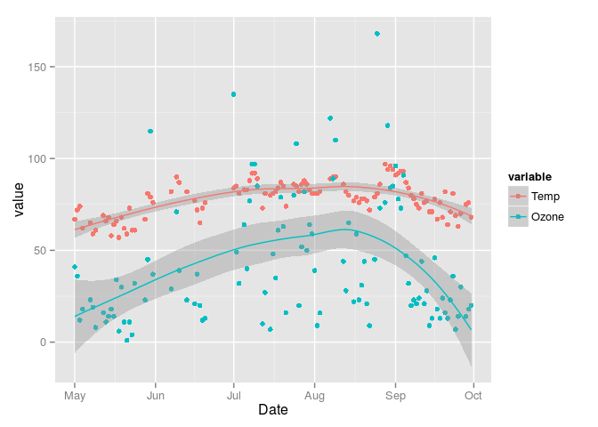

# Air Quality Data Exploration
Brian High  
Thursday, May 07, 2015  

Load the dataset
----------------

Let's explore the [New York Air Quality Measurements](http://stat.ethz.ch/R-manual/R-patched/library/datasets/html/airquality.html) from R's `dataset` package. We'll start
by loading the dataset and examining the structure.


```r
library(datasets)
data(airquality)

str(airquality)
```

```
## 'data.frame':	153 obs. of  6 variables:
##  $ Ozone  : int  41 36 12 18 NA 28 23 19 8 NA ...
##  $ Solar.R: int  190 118 149 313 NA NA 299 99 19 194 ...
##  $ Wind   : num  7.4 8 12.6 11.5 14.3 14.9 8.6 13.8 20.1 8.6 ...
##  $ Temp   : int  67 72 74 62 56 66 65 59 61 69 ...
##  $ Month  : int  5 5 5 5 5 5 5 5 5 5 ...
##  $ Day    : int  1 2 3 4 5 6 7 8 9 10 ...
```

View some rows
--------------

It is always a good idea to take a look at a few rows of data to get oriented.


```r
head(airquality)
```

```
##   Ozone Solar.R Wind Temp Month Day
## 1    41     190  7.4   67     5   1
## 2    36     118  8.0   72     5   2
## 3    12     149 12.6   74     5   3
## 4    18     313 11.5   62     5   4
## 5    NA      NA 14.3   56     5   5
## 6    28      NA 14.9   66     5   6
```

```r
tail(airquality)
```

```
##     Ozone Solar.R Wind Temp Month Day
## 148    14      20 16.6   63     9  25
## 149    30     193  6.9   70     9  26
## 150    NA     145 13.2   77     9  27
## 151    14     191 14.3   75     9  28
## 152    18     131  8.0   76     9  29
## 153    20     223 11.5   68     9  30
```

Basic statistical summary
-------------------------

With `summary`, we get a quick view of `NA`s, max, min, median, mean and first 
and third quartiles.


```r
summary(airquality)
```

```
##      Ozone           Solar.R           Wind             Temp      
##  Min.   :  1.00   Min.   :  7.0   Min.   : 1.700   Min.   :56.00  
##  1st Qu.: 18.00   1st Qu.:115.8   1st Qu.: 7.400   1st Qu.:72.00  
##  Median : 31.50   Median :205.0   Median : 9.700   Median :79.00  
##  Mean   : 42.13   Mean   :185.9   Mean   : 9.958   Mean   :77.88  
##  3rd Qu.: 63.25   3rd Qu.:258.8   3rd Qu.:11.500   3rd Qu.:85.00  
##  Max.   :168.00   Max.   :334.0   Max.   :20.700   Max.   :97.00  
##  NA's   :37       NA's   :7                                       
##      Month            Day      
##  Min.   :5.000   Min.   : 1.0  
##  1st Qu.:6.000   1st Qu.: 8.0  
##  Median :7.000   Median :16.0  
##  Mean   :6.993   Mean   :15.8  
##  3rd Qu.:8.000   3rd Qu.:23.0  
##  Max.   :9.000   Max.   :31.0  
## 
```

Pairwise matrix of scatterplots
-------------------------------

Using `pairs`, we can examine relationships between pairs of variables.


```r
pairs(airquality, panel = panel.smooth)
```

 

Linear model fit
----------------

We can produce a summary of linear model fit statistics with `lm` and `summary`.


```r
summary(lm(Ozone ~ Wind + Solar.R + Temp, data = airquality))
```

```
## 
## Call:
## lm(formula = Ozone ~ Wind + Solar.R + Temp, data = airquality)
## 
## Residuals:
##     Min      1Q  Median      3Q     Max 
## -40.485 -14.219  -3.551  10.097  95.619 
## 
## Coefficients:
##              Estimate Std. Error t value Pr(>|t|)    
## (Intercept) -64.34208   23.05472  -2.791  0.00623 ** 
## Wind         -3.33359    0.65441  -5.094 1.52e-06 ***
## Solar.R       0.05982    0.02319   2.580  0.01124 *  
## Temp          1.65209    0.25353   6.516 2.42e-09 ***
## ---
## Signif. codes:  0 '***' 0.001 '**' 0.01 '*' 0.05 '.' 0.1 ' ' 1
## 
## Residual standard error: 21.18 on 107 degrees of freedom
##   (42 observations deleted due to missingness)
## Multiple R-squared:  0.6059,	Adjusted R-squared:  0.5948 
## F-statistic: 54.83 on 3 and 107 DF,  p-value: < 2.2e-16
```

Remove the NA values
--------------------

To avoid warnings with `qplot` and `ggplot`, we first need to remove the `NA` 
values with `na.omit`. We will create a new `data.frame` in the process, so that
the original dataset will remain unchanged.


```r
df <- na.omit(as.data.frame(airquality))
summary(df)
```

```
##      Ozone          Solar.R           Wind            Temp      
##  Min.   :  1.0   Min.   :  7.0   Min.   : 2.30   Min.   :57.00  
##  1st Qu.: 18.0   1st Qu.:113.5   1st Qu.: 7.40   1st Qu.:71.00  
##  Median : 31.0   Median :207.0   Median : 9.70   Median :79.00  
##  Mean   : 42.1   Mean   :184.8   Mean   : 9.94   Mean   :77.79  
##  3rd Qu.: 62.0   3rd Qu.:255.5   3rd Qu.:11.50   3rd Qu.:84.50  
##  Max.   :168.0   Max.   :334.0   Max.   :20.70   Max.   :97.00  
##      Month            Day       
##  Min.   :5.000   Min.   : 1.00  
##  1st Qu.:6.000   1st Qu.: 9.00  
##  Median :7.000   Median :16.00  
##  Mean   :7.216   Mean   :15.95  
##  3rd Qu.:9.000   3rd Qu.:22.50  
##  Max.   :9.000   Max.   :31.00
```

Plot Ozone versus Temp
----------------------

Plot `Ozone` versus `Temp` with a linear regression fit using `qplot` and `method="lm"`.


```r
library(ggplot2)
qplot(Temp, Ozone, data=df, geom=c("point", "smooth"), method="lm")
```

 

Add a Date column
-----------------

Knowing the data was collected in 1973, we can combine this year with the `Month` 
and `Day` to get a `Date` column. That will allow us to produce a time series plot.


```r
df$Date <- as.Date(paste("1973", df$Month, df$Day, sep="-"), "%Y-%m-%d")
str(df)
```

```
## 'data.frame':	111 obs. of  7 variables:
##  $ Ozone  : int  41 36 12 18 23 19 8 16 11 14 ...
##  $ Solar.R: int  190 118 149 313 299 99 19 256 290 274 ...
##  $ Wind   : num  7.4 8 12.6 11.5 8.6 13.8 20.1 9.7 9.2 10.9 ...
##  $ Temp   : int  67 72 74 62 65 59 61 69 66 68 ...
##  $ Month  : int  5 5 5 5 5 5 5 5 5 5 ...
##  $ Day    : int  1 2 3 4 7 8 9 12 13 14 ...
##  $ Date   : Date, format: "1973-05-01" "1973-05-02" ...
##  - attr(*, "na.action")=Class 'omit'  Named int [1:42] 5 6 10 11 25 26 27 32 33 34 ...
##   .. ..- attr(*, "names")= chr [1:42] "5" "6" "10" "11" ...
```

Reshape Temp and Ozone
----------------------

We will `select` only the `Temp`, `Ozone`, and `Date` variables, then "reshape"
the dataset into a "long" format with `melt`.


```r
suppressMessages(library(dplyr))
df <- select(df, Temp, Ozone, Date) 

library(reshape2)
df <- melt(df, id="Date")

str(df)
```

```
## 'data.frame':	222 obs. of  3 variables:
##  $ Date    : Date, format: "1973-05-01" "1973-05-02" ...
##  $ variable: Factor w/ 2 levels "Temp","Ozone": 1 1 1 1 1 1 1 1 1 1 ...
##  $ value   : int  67 72 74 62 65 59 61 69 66 68 ...
```

Time Series Plot
----------------

Now we can plot `Temp` and `Ozone` in a time series, with "loess" curves. 


```r
ggplot(df, aes(x=Date, y=value, colour=variable, group=variable)) +
   geom_point(aes(y=value, colour=variable)) + geom_smooth(method="loess")
```

 
